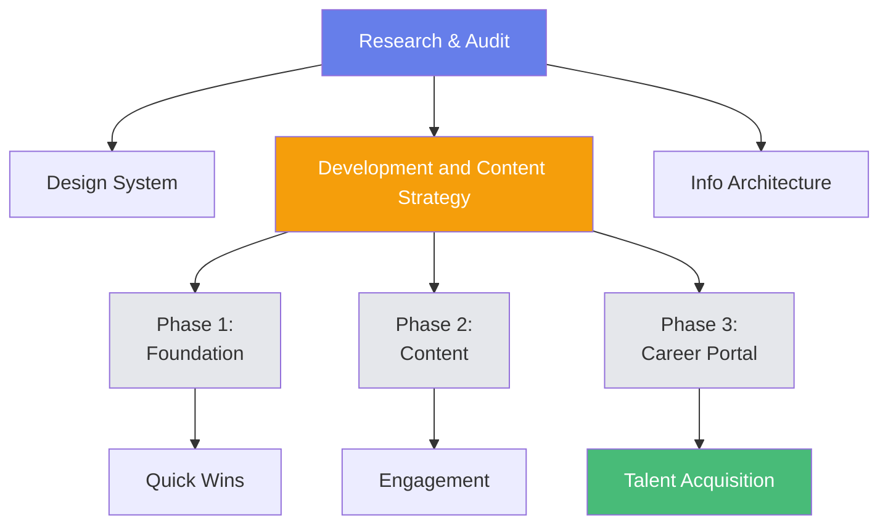
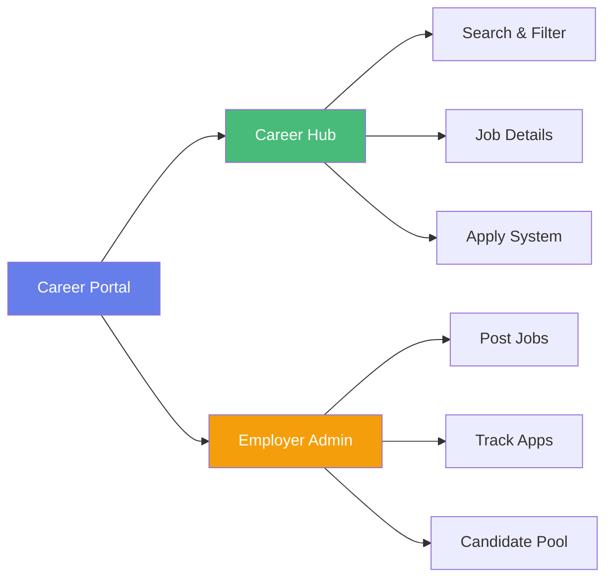
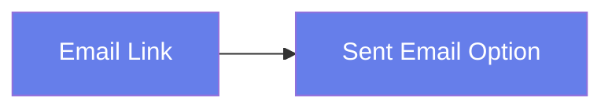
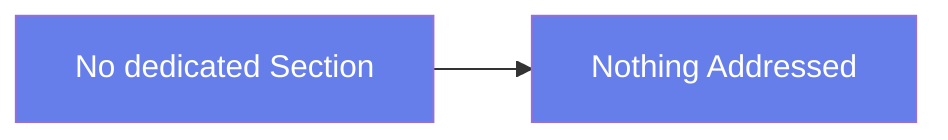

## Introduction

Renovating the Pepsi Bangladesh website was such an eye-opening experience! It really allowed me to dive into improving both the user experience and the user interface. My journey started back in university when I worked on simple HTML and CSS websites, which helped me develop the skills to spot the issues.

## Redesigning Pepsi Bangladesh Website

| Dhaka, Bangladesh         | Project Timeline | Viewership   |
| ------------------------- | ---------------- | ------------ |
| Transcom Beverage Limited | 7 Month          | 40% Increase |

![[Pasted image 20251122144727.png]]*From Cluttered Corporate Site to User-Centric Digital Experience.*

Transcom Beverages Ltd., an exclusive **franchise of PepsiCo**, began operations in 2000 as the sole franchisee of PepsiCo International, a global leader in food and beverages. Since its inception, the company has been dedicated to inspiring and refreshing lives in Bangladesh.

### Core Challenge

Former Pepsi website was clunky, the UI was not up to the mark, the information hierarchy was off with just one webpage trying to fit all the information about the website. The user had no intuitive way to go through the whole website. With 12 overcrowded sections, 3 competing typefaces, and zero mobile optimization, the site was confusing consumers, and failing to represent TBL's market-leading brand position

> Challenge: Transform a Cluttered, information-overloaded WordPress site into a functioning, mobile-first digital experience that attracts talent, engages consumer and re-aligned the website with the brand vision of PepsiCo and TBL. 

**Project Impact:**

- 🎯 **30% projected reduction** in bounce rate
- 📱 **50% increase** in mobile engagement
- 💼 **200+ talent profiles** in candidate pipeline
- ⚡ **5-minute application process** (down from abandoned attempts)

### Core Problems

| Visual Hierarchy                           | Navigational Chaos                                  | Content Architecture Failure              |
| ------------------------------------------ | --------------------------------------------------- | ----------------------------------------- |
| Three Different Fonts Competing each other | Overcrowded navigation with many menu items         | Poor Mobile UX with bad first impression  |
| Undistinguishable Content Types            | Uneven information causing decision paralysis       | Cumbersome, structureless text dump       |
| Cognitive Fatigue within Seconds           | Lack of smartphone-friendly design user abandonment | Overwhelming and fragmentated information |

### Solution

The solution is three fold with a core strategic approach in mind for creating a redesigned website that is mobile-first, content-second, and scale-third. 




### Strategy

To address the design system I strategize the design system where one primary font, clean navigation and progressive disclosure of information. Here are the solution for the redesigned website:


#### Typography:

Before:

```text
MONTESERRAT + RALEWAY + Open Sans = Confusion
```

![[Pasted image 20251122191400.png]]


After:

```
Pepsi Branded Fonts Based on Open Sasns
```

![[Pasted image 20251122191441.png]]

#### Information Architecture Transformation

Before all the information was crammed into this one landing page, it was confusing, cluttered and broken lack of organization

Before:

![[Pasted image 20251122202221.png]]

After:
![[Pasted image 20251122202239.png]]*From Cluttered to clustered information for the new website design*

#### Navigation Simplification

Before there were 12+ menu Items with uneven spacing and cluttered branding and desktop only design,

![[Pasted image 20251122192406.png]]

To address this I rethink the navigation system that full filled the demand of providing more flexible navigation system for the user

![[Pasted image 20251122193016.png]]

The redesigned navigation system just make it easier, seamless with 7 core items with clean logo placement and mobile friendly implementation. 

![[Pasted image 20251122201711.png]]
*Re-designed with mobile-first design in mind*

#### News Consolidation
Before the implementation of unified press release news, TVC's and events were scattered across three section. Now they are unified into a single "Stories and Update" module. 

Before:
![[Pasted image 20251122233830.png]]
*Separate section with no co-ordination*
Suggested:
![[Pasted image 20251122234015.png]]
*Tabulated views for news, social media handles, TVC's, Events, and Stories*
After:
![[Pasted image 20251128185740.png]]
### Key Feature: Career Portal
One of the major reason of redesigning the website was to attract talent. Around 35% of redesign effort goes into developing talent acquisition is TBL's critical business priority.
The implementation was two fold create a Job seeker site which is mainly facilitated by a career hub page. 



#### Career Hub
Career Hub Internal page handles visual outward projection of how industry talent's are joining TBL and sharing their journey. This is the supplemented with CTA to job listing where candidate can search jobs by different filter parameters. 

Before:


Suggested:
![[Pasted image 20251122235703.png]]

After:
![[Pasted image 20251128185907.png]]
##### Career Portal:
The career portal features the holistic approach of providing candidates everything they need to apply for their dream job in the TBL. I made sure it was intuitive, filterable and decisive to achieve their end goal of applying to the right jobs. 

![[Pasted image 20251123000834.png]]

#### Women at TBL
The career hub page has explicit focus on women's empowerment = addressing gender diversity gap in TBL corporate sector. 

Before:


After:
![[Pasted image 20251123000012.png]]

#### User Flow:
In order co-ordinate all the different stack-holder I redesign the full user flow to get everyone in line with core idea of the website and how the homepage is connected with internal page the most efficient way possible.

![[Pasted image 20251123001006.png]]

### The Impact
#### 1. **Integrated Recruitment Ecosystem**

First beverage company in Bangladesh with enterprise-grade career portal embedded in corporate website

#### 2. **Progressive Disclosure Architecture**

Solved information overload through strategic content layering while maintaining SEO value

#### 3. **Mobile-First Heritage**

Designed mobile-first despite desktop-heavy legacy, preparing for mobile-dominant future

#### 4. **Women at TBL Initiative**

Pioneering gender diversity campaign in traditionally male-dominated industry

#### 5. **Product-Centric Emotional Design**

Shifted from corporate logos to consumer products for authentic brand connection

### Final Product

![[Pasted image 20251123004614.png]]

![[Pasted image 20251123004752.png]]

Reference:
[Pepsi](https://tbl.com.bd/)


