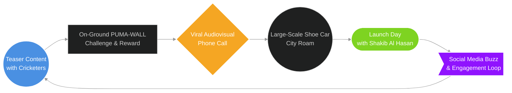

## PUMA Chase The Greatness

### The Beginning

Puma is a world-class sportswear and apparel brand. Puma, with all its fame and its "Forever Faster" brand glory, wanted to open a flagship outlet in one of Bangladesh's busiest and second-biggest cities, Chattogram.

### Objective:

We were tasked with the challenging responsibility to create as much greatness as possible for its flagship outlet launch day. Keeping the "Forever Faster" motto in mind, we started chasing the greatness of both PUMA and Chattogram City. We figured that in order to create enough buzz in the already crowded city, we needed something powerful, something that packs a punch in terms of its greatness and its impact.

### Chase The Greatness:

After receiving the brief, we started thinking about a lot of different approaches. We found out that the campaign needs a strong message that resonates with both the brand and the city. What's interesting is that Chattogram has a short acronym, CTG; we started fooling around with it, and suddenly we landed on this full form: "Chase the Greatness." Bam! This works like a charm! It seemingly and strategically conveys both the "Forever Faster" and the grandiosity of Chattogram City. Ironically, we were chasing this tagline for quite a while—glad we found something interesting. "Chase the Greatness"—a perfect tagline for a perfect launch campaign. #chasethegreatness

### Strategy:

I was tasked with figuring out a way to increase footfall on launch day. The challenge was to find something that provides incentive to the audience and enough buzz for PUMA fans to know about the launch day. Also, to create enough activity and content put together strategically to stay at the top of the audience's mind for the whole duration of the campaign. One problem is that the audience can be varied for a sports brand like PUMA, so I facilitated audience segmentation by using generative AI, providing it with enough context to figure out the different audiences and their needs for social media. In accordance with the audience segmentation, I devised the following five steps in an $360\deg$ integrated digital and on-ground strategy where everything feeds itself.

1. PUMA is a sports brand, so it makes sense to involve a sports celebrity—and luckily, we got one: Shakib Al Hasan, the world-ranking number-one cricket player.
    
2. People need a challenge and a reward, so we set up an on-ground mural-like structure named "PUMA-WALL" to feature Chattogram City and its rich heritage, and the reward was a meet-up with Shakib Al Hasan at the launch venue.
    
3. To create enough buzz, we created social media teaser content featuring other famous cricketers in collaboration with Shakib Al Hasan.
    
4. We wanted to attract the attention of the young generation, so we created a funny phone call audiovisual featuring a funny audio artist—and on its launch day, it went viral!
    
5. To make it the talk of the town, we created a large-scale PUMA sports shoe on a car to roam around the city; this single initiative grabbed huge attention in the city.
    

### Execution:

In order to achieve a cohesive, coordinated, and seamless execution of the campaign, I planned a user flow and user experiences for a microsite, urging the audience to share their image through the microsite along with social media sharing of the post and tagging as many friends as they possibly can. The winner gets a gift hamper from the celebrity all-rounder cricketer Shakib Al Hasan. We scheduled all the teaser posts beforehand to match each step of the execution to hype up the audience even more.

![[Pasted image 20251110152623.png|large-scale puma shoe car transformation]]
*Photo: Puma Large-Scale Shoe Car Transformation*

There were some challenges and frictions along the way—for example, some of the teaser posts did not post as they were waiting on the celebrity cricketer's schedule. It was quite a hassle to align the social media teasers and to reveal the teaser posts. The PUMA life-like shoe car was late to reach the city, but it was still so surprising—people wildly shared it on social media.

### The Launch Day:

![[Pasted image 20251110152020.png|PUMA]]
*Photo: Puma Outlet Inauguration Day, 2023* [^1]

It was the most exciting part of the campaign. Generally, we observe people going crazy for their celebrity on television, social media, or at concerts. It was beyond all the expectations of everyone who worked on this campaign that the crowd went absolutely berserk for Shakib Al Hasan. It is this single moment that defines the whole campaign's success. The rejoicing of the people who attended, the shouting and random mumbling of words mixed with all the lighting and music made this launch a truly grandiose day for PUMA and Chattogram City.

### **Results:**

The audience from Chattogram City spontaneously engaged with this campaign. The experimental and somewhat audacious nature of this strategy led to some incredible results; this proves the power of integrated marketing:

1. Compared to previous outlet launches, this campaign achieved an astounding **150% increase in opening day foot traffic**.
    
2. Almost **35% conversion rate on the campaign microsite** proved the audience really loved the outdoor mural idea—an activity they will cherish.
    
3. It drove a **275% increase in social media engagement**; the teasers, the reveals, and the surprises really did their work.
    
4. And finally, a Gold Award at the **Flame Awards Asia 2024 for "Best Innovative Campaign of the Year"**.
    
5. It received the **2024 Bangladesh Digital Innovation Award for "Digital Excellence"**.
    

The whole campaign and its activities fit together like a jigsaw puzzle, creating an exciting journey that ended with success. It was stressful, joyful, and delightful to be involved with PUMA and its launch day campaign initiative.

### **The Good, Bad and Ugly**

If you have come to this point then You might want to see more about how I designed the full strategy in its entirety. 

#### Footnote
[^1]: [(14) Post | LinkedIn](https://www.linkedin.com/posts/dblgroup_dbl-group-has-launched-4th-puma-store-at-activity-7020032437061648384-sVi8/)
