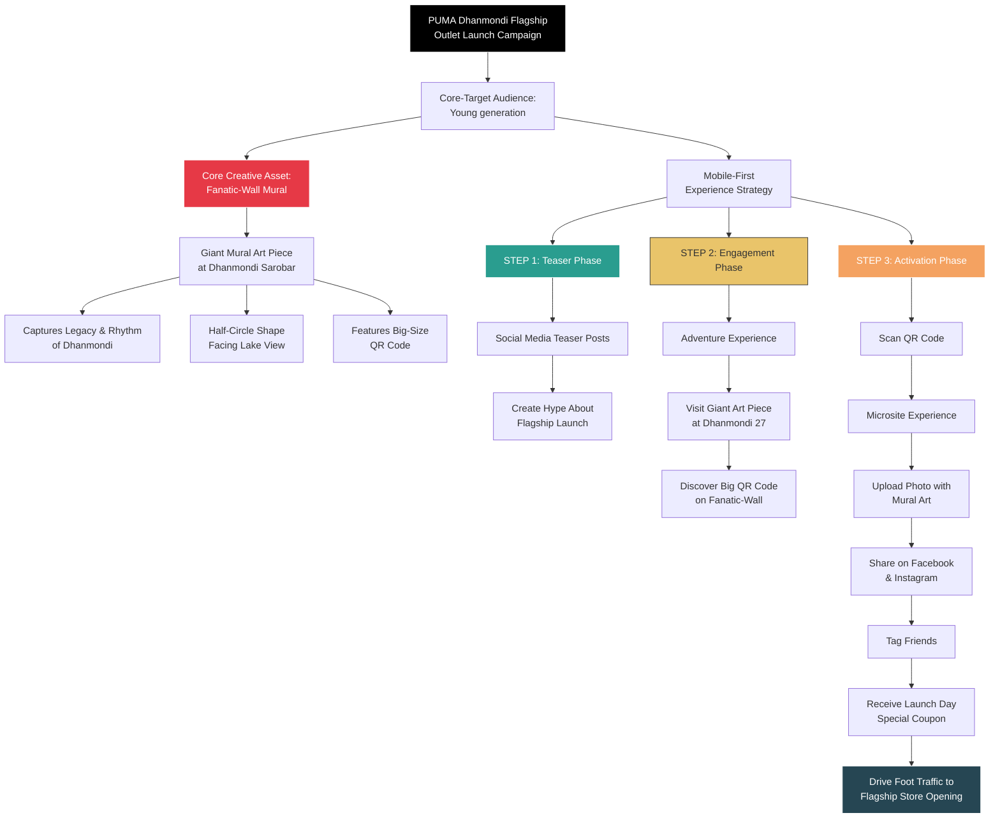

## Puma Fanatic-Wall

Puma just launched their first flagship store in one of prime location of Dhaka city. But they got their eye on another location of Dhaka, Bangladesh. "Dhanmondi", it suits the brand as the flow, the rhythm of motion and the beats it carries. This very location, it's lively, it's charming and it's always in style. Puma does not need it, it needs Puma. 

### Objective

It did not take much to get us involved and without any doubt we knew that we are going to be a part of an exciting journey ahead. We were briefed to go as wild as we can get. After the brief, we got into the action immediately. 'Dhanmondi' carries this long legacy, it has a rich tradition and it has a special place in peoples heart and mind. We immediately thought whatever we do, it has to be at "Dhanmondi 27" and it's surrounding area. At first we wanted to capture the whole "Dhanmondi" But to make things more focused and interesting we decided to do the main gimmick of our campaign at the "Rabindra Sarobar" right beside the "Dhanmondi Lake". After digging some data about Park we found that in Dhaka city parks are visited by around 47% from the age of 13 to 29 years old and about 30% of the visits are to meet friends. [[Footnote](https://healthbridge.ca/dist/library/dhaka-park-report_final.pdf)] 

### Strategy

It became apparent that our campaign core audience will be young people and to create the massive buzz around the launching of the Puma Dhanmondi Flagship Outlet. To capture the young generation we understood that we need a unique mobile first experience. We also needed to capture the rhythm and vibrance of Dhanmondi and came up with an idea of building a huge Mural Art Piece named "Fanatic-Wall" that capture the legacy, the rhythm and wrap the unique half circle shape of the "Dhanmondi Sarobar" facing the lake view.  I was responsible for designing a microsite to make the whole campaign experience a 360 deg integrated experience and social media content strategy to create hype about the campaign. So, I design a three step plan as following

1. Teaser posts about the PUMA Dhanmondi 27 flagship Outlet Launching, to create hype about the launching.
2. Having the young and vibrant audience at mind creating an interesting adventure of going to the giant-size Art piece with Big-Size QR code.
3. Scan the QR code beside the Art Piece and upload it in the microsite and share it on Facebook and Instagram to tag as many friend as possible to get launching day special coupon.

This whole strategy can be understand better visually in the following:

### Microsite in Motion

Web technology is a great passion of mine. Initially I wanted to created a detailed user flow and potentially a low fidelity wireframe to assist our inhouse web-designer. But ended up almost creating full fledge UI/UX myself. And the fun fact is that I did the whole design right in the **Power Point** and then use **Miro** to patch all the separate pieces together. Luckily when I was thinking about the UI for the microsite, design team already develop a lot of different key visuals for different purposes. These creative assets help me design the high fidelity **UI/UX** myself. My work of art! 😎 helps designers to have a great head start to develop the final design. 

![[Pasted image 20251112202630.png]]

This was an interesting journey of strategizing each layouts and exploring the thought process about how the user-interface and user-experience should be. This microsite was the single most important things for us come up as it serves a great conjunction between the digital and on-ground campaign activity. 

### Execution

As fun as it was designing the microsite it was not easy for the developer to build it. We are short on time for everything and we had to do all the pre-planning, researching and execution of the campaign in about one week. The developers got the final design to build the microsite right before the campaign launching day, there are couple of technical things that were not working, it was some moments of tearing our hair out. The developers work hard the whole night and they were able to complete the site on the launch day morning! That was some stressful time. Before we could sigh our relief, the microsite started to show another technical issue. The visitors that were trying to upload their selfie with the mural art piece, could not upload their images. We were trying to upload images from our phone but could not find out the problem. But after some digging it became clear that some smart phone were taking 4mb to 5mb size images, our server was not capable enough to handle such big images. We literally could not make this individual issue in the campaign opening day and campaign was active for 3 days. The Puma outlet launching day was the last day of the campaign day. It was so intense, but our developer after understanding the problem solve it pretty fast and the day was saved! 😮‍💨 

### Result

The campaign achieved astounding results, it was our hard work paid off in full return. The visitors that came into the lake park through out the campaigns were amazed, surprised and took selfies after selfies. Here are some numbers to picture it out:

- The campaign garnered **more than 200,000 footfalls at the event**.
- It achieved **300,000 social media reach**.
- **More than 10,000 individuals registered with their selfies** for discount coupons.
- Winning the "**commaward in 2022 in the best outdoor campaign category**".

This campaigns was my first adventure into the nitty gritty of advertising connecting the digital and on-ground campaign activities. Designing a user journey that started from the QR code and ended with winning coupon for the launching day of Puma Flagship Outlet in Dhanmondi 27. 

Visuals:
![[Pasted image 20251112225235.png]]