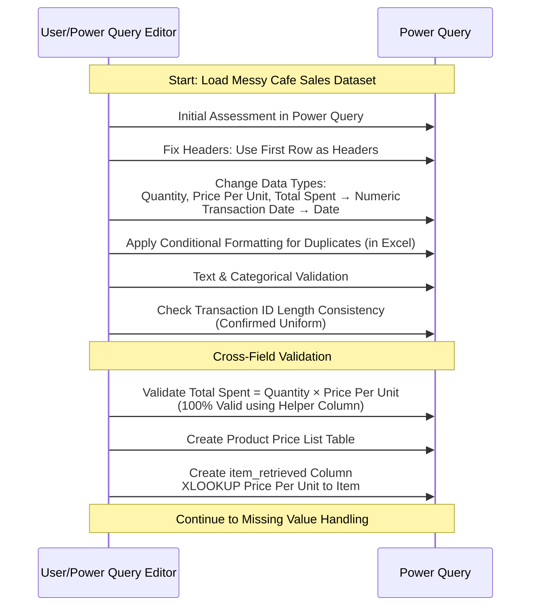
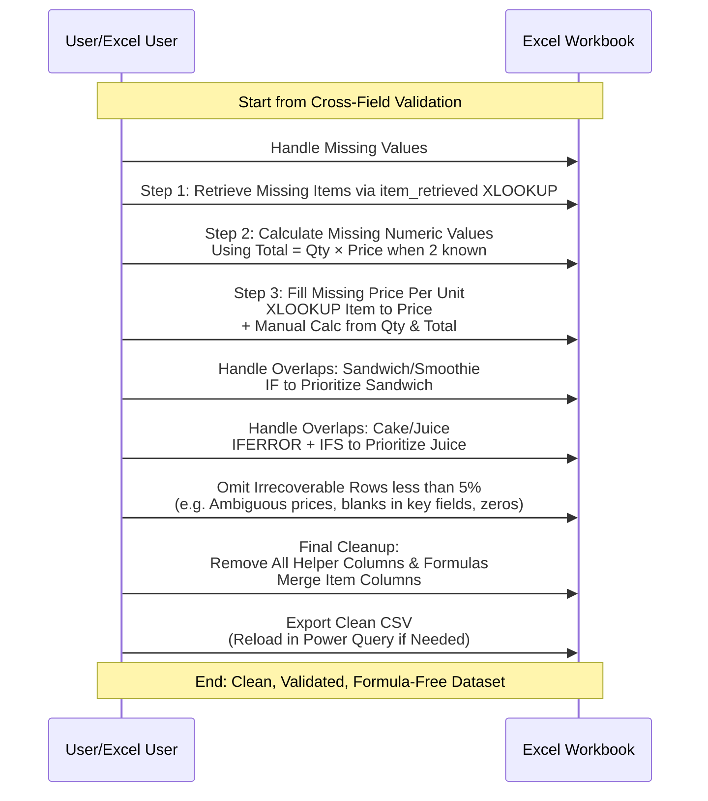

##  Cafe Sales Data Cleaning Process

## 🎯 Project Objectives

- Clean and validate a messy transactional dataset containing errors, null values, and inconsistencies
- Recover missing data using logical inference and reference tables
- Ensure mathematical accuracy across interdependent numeric columns
- Create a performance-optimized, formula-free dataset ready for business analysis

---
## Technologies Used: 

- **Microsoft Excel**: Data manipulation, validation, advanced functions
- **Power Query**: Data transformation and loading
- **CSV Export**: Performance optimization and portability
- **Conditional Logic**: Automated decision-making
- **Reference Tables**: Data validation and recovery

---
## Dataset Overview
![[Pasted image 20251224123730.png]]

This document outlines the systematic approach to cleaning a messy cafe sales dataset containing errors, null values, unknown entries, and missing values across all columns. The dataset includes numerical columns (`Quantity`, `Price Per Unit`, `Total Spent`) and a `Transaction Date` column.

## Original Dataset Statistics

| Metric             | Value  | Percentage |
| ------------------ | ------ | ---------- |
| **Total Rows**     | 10,000 | 100%       |
| **Corrupted Rows** | ==9,622==  | ==96.22%==     |
| **Clean Rows**     | 378    | 3.78%      |

## Data Recovery Results

| Metric                  | Value | Percentage              |
| ----------------------- | ----- | ----------------------- |
| **Recovered Rows**      | ==3,463== | ==36% of corrupted data==   |
| **Unrecoverable Rows**  | 6,159 | 64% of corrupted data   |
| **Final Clean Dataset** | 3,841 | 38.41% of original data |

### Data Quality Improvement

- **Before**: Only 3.78% usable data (378 rows)
- **After**: 38.41% validated, analysis-ready data (3,841 rows)
- **Recovery Achievement**: 3,463 previously unusable records salvaged
- **Net Improvement**: **10x increase** in usable data

_Note: The 64% unrecoverable data consisted of records with insufficient information. For reliable recovery, maintaining data integrity standards over quantity._

---
## Data Cleaning Methodology
## 1. Data Constraint Issues

### Initial Assessment
![[Pasted image 20251224125425.png]]
The dataset was loaded into Power Query for initial data constraint checks to identify faulty data types, range issues, and uniqueness problems.

**Observations:**

1. No numerical range considerations required for numerical columns
2. Conditional formatting with color shows no duplicated values in any column
3. No row duplications detected

**Problems Identified:**

1. First row not detected as header row
2. `Quantity`, `Price Per Unit`, `Total Spent`, and `Transaction Date` have incorrect data types

**Solutions Applied:**

1. Set first row as headers using Home ribbon > "Use first row as headers"
2. Changed text-based data types to appropriate numeric types (`Whole Number` and `Decimal Number`)
3. Applied conditional formatting to entire `table[dirty_cafe_sales]` to catch future duplications

---

## 2. Text and Categorical Data Issues

### Validation Check

Verified text data for consistency, length, and proper formatting.

**Observations:**

1. ✅ Proper letter case formatting already applied
2. ✅ Categorical data has consistent categories (no variations like "Credit Card" vs. "Credit Visa Card")
3. ✅ Proper case applied across all categorical columns

**Problem Identified:**

1. `Transaction ID` string length needs validation to ensure consistency

**Solution Applied:**

1. Used Extract > Length function to analyze `Transaction ID` length
2. Filter confirmed one unique string length across all rows

---

## 3. Data Uniformity Issues

### Cross-Field Validation

Checked numeric columns for proper values, date formatting, and cross-field validation for aggregated rows.

**Problems Identified:**

1. Date column lacks proper date format
2. Numeric columns lack proper numeric format
3. Need to validate `Total Spent` accuracy based on `Quantity` × `Price Per Unit`
4. Need to validate `Item` and `Price Per Unit` data accuracy
5. Need to verify `Price Per Unit` values match each `Item`

**Solutions Applied:**

1. Transformed date column to proper date format in Power Query
2. Applied correct data types to numeric columns
3. Created validation formula for `Total Spent`:
    
    ```excel
    =IF([@Quantity]*[@[Price Per Unit]]=[@[Total Spent]],"valid","not valid")
    ```
    
    - Result: 100% validation achieved
4. Created `Product Price List` table for `Price Per Unit` validation
5. Used `item_retrieved` column in conjunction with Product Price Excel sheet for validation




---

## 4. Missing Value Issues

### Analysis

**Observations:**

1. `Item` column contains `Empty`, `Unknown`, and `Error` values, but corresponding rows have both `Quantity` and `Price Per Unit` values
2. Some rows have missing `Quantity` values but contain `Total Spent` values
3. `Price Per Unit` column has `Error`, `Unknown`, and `Empty` values where `Item` column has valid values

**Problems Identified:**

1. String, date, and categorical columns (`Item`, `Payment Method`, `Location`, `Transaction Date`) contain `Unknown`, `Error`, and `Empty` values
2. `Quantity` has `Unknown`, `Empty`, `Error`, and `Null` values
3. `Price Per Unit` has `Error` and `Null` values
4. `Total Spent` has `Error` and `Null` values
5. Missing `Total Spent` values where both `Quantity` and `Price Per Unit` are present
6. Some rows have values in `Quantity` but empty `Price Per Unit`, and vice versa

### Solutions Applied

**Step 1: Retrieve Missing Item Names** Created `Item_retrieved` column using XLOOKUP function:

```excel
=XLOOKUP([@[Price Per Unit]],product_price_list[Price Per Unit],product_price_list[Product Item],"",0)
```

**Step 2: Calculate Missing Values Using Mathematical Relationships** Used the formula: `Total Spent = Quantity × Price Per Unit`

- Calculated missing values when two of three columns had data based on the formula.
- This automatically populated missing item values in `item_retrieved` column
- Filtered `Quantity`, `Price Per Unit`, and `Total Spent` by `Empty`, `#DIV0`, and `0`
- Provides understanding how the missing data's are connected but give lots of error.
- Reset and start as discussed in step-3.

**Step 3: Address Price Per Unit Missing Values** ⚠️ **Important:** Started with `Price Per Unit` column as it doesn't depend on other columns

- Applied XLOOKUP to retrieve prices from `Item` column:
    
    ```excel
    =XLOOKUP([@Item],product_price_list[Product Item],product_price_list[Price Per Unit],0,0)
    ```
    
- Filtered by `0` values and calculated `Price Per Unit` using `Quantity` and `Total Spent` in helper column for easy copy-paste
- ~850+ zeros remained after initial lookup; applied second XLOOKUP using `Item` column
- Some zeros with missing corresponding `Item` values had no available solution

**Step 4: Handle Duplicate Pricing Issues** `Sandwich` and `Smoothie` share the same price point, causing XLOOKUP to default to `Smoothie`

- Applied bidirectional IF function:
    
    ```excel
    =IF(AND([@Item]="Sandwich",[@[item_retrieved]]="Smoothie"),"Sandwich",[@[item_retrieved]])
    ```
    
- Filtered by `Price Per Unit = 4` with `Blanks, UNKNOWN, ERROR` in `Item` column: 198 rows out of 10,000 (<5%)
- **Decision:** Omitted these rows as they represent less than 5% of total data

**Step 5: Handle Additional Missing Values** The following data points were omitted (all <5% of total data):

- `Total Spent = 0` with missing `Quantity`
- Both `Total Spent = 0` and `Price Per Unit = 0` with `Blank, UNKNOWN, Error` values
- `Total Spent = 0` and `Quantity = Blank`
- `Blank` values in `Transaction Date`
- `Blank, Error, Unknown` values in `Location`
- `Blank, Error, Unknown` values in `Payment Method`

**Step 6: Handle Cake and Juice Pricing Overlap** `Cake` and `Juice` have similar pricing, requiring enhanced IF function:

```excel
=IFERROR(IFS(AND([@Item]="Sandwich",[@[item_retrieved]]="Smoothie"),"Sandwich",AND([@Item]="Juice",[@[item_retrieved]]="Cake"),"Juice"),[@[item_retrieved]])
```

**Step 7: Final Cleanup**

- Exported as CSV file
- Loaded into Power Query
- All logical functions automatically removed from dataset by Power Query 
- Merged all `Item`-related columns (Main + Helper)




---


## Conclusion

The data cleaning process successfully transformed the messy dataset into a clean, validated dataset ready for analysis. All formulas were removed in the final version to ensure optimal performance.

**Key Achievements:**

- 100% validation on `Total Spent` calculations
- Successfully retrieved more 39% missing values
- Omitted < 60% of problematic data that couldn't be reliably recovered
- Created a performant, formula-free final dataset

**Core Competencies**: #DataCleaning • #DataValidation • #Excel • #PowerQuery • #ProblemSolving • #ProcessDocumentation • #QualityAssurance • #PerformanceOptimization